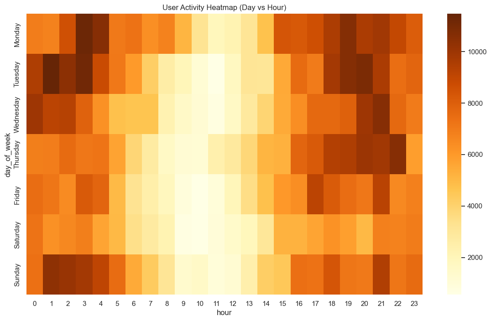
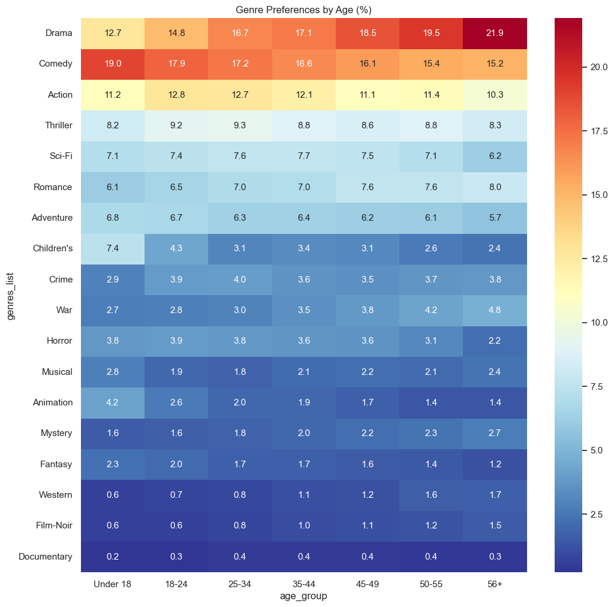
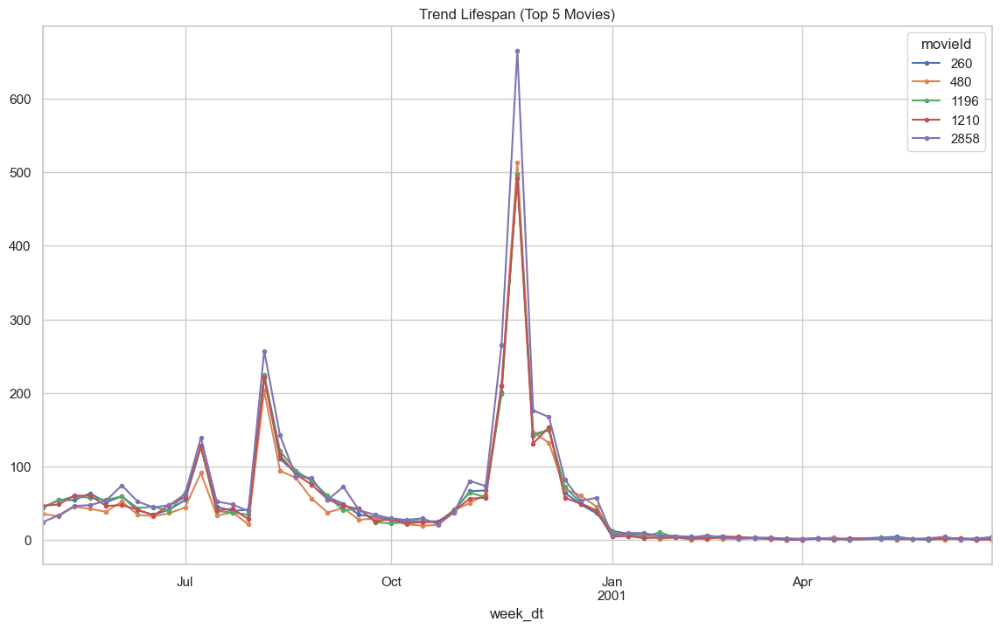
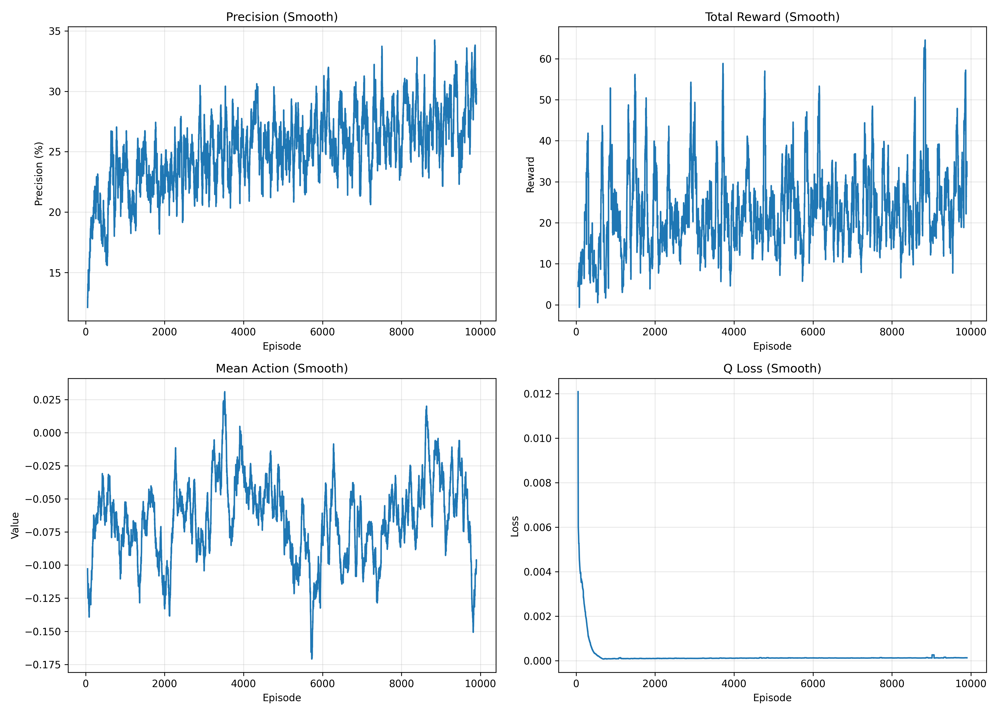
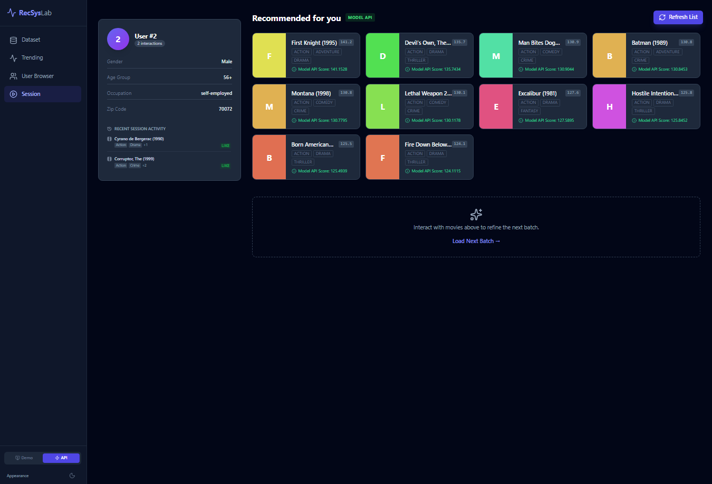
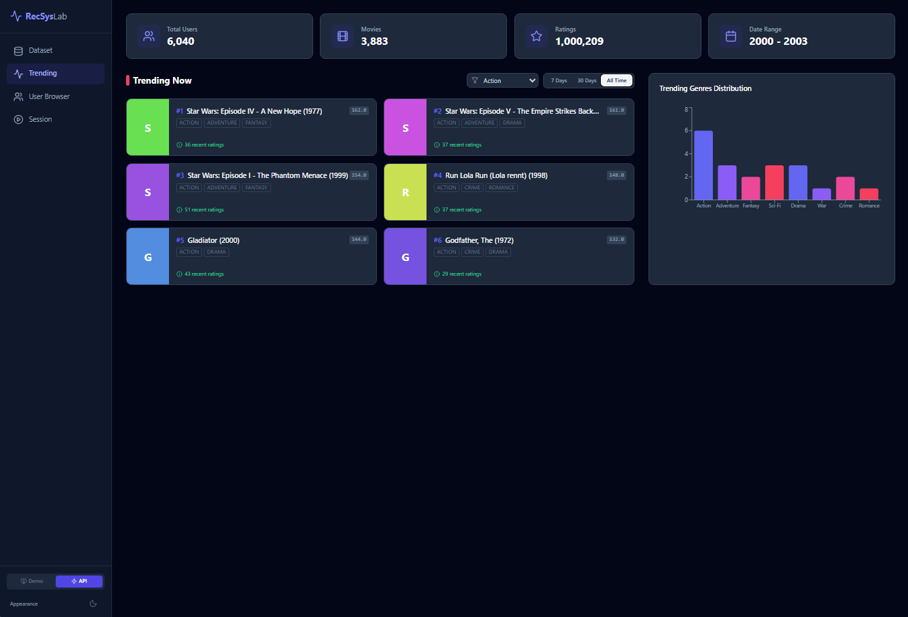

# WebMining-RecSys
# DRR: Deep Reinforcement Learning based Recommendation

Deep Reinforcement Learning–based Recommendation (DRR) là mô hình gợi ý sử dụng **Actor–Critic (DDPG)** để tối ưu hóa quyết định gợi ý theo chuỗi tương tác người dùng, tập trung vào **phần thưởng dài hạn** thay vì dự đoán rating độc lập.

## Model Architecture (MDP Formulation)
Hệ thống được mô hình hóa dưới dạng Markov Decision Process (MDP) $(S, A, P, R, \gamma)$:
*   **State ($S$):** Biểu diễn lịch sử tương tác tích cực của người dùng $H_t = \{i_1, ..., i_n\}$ qua module State Representation,.
*   **Action ($A$):** Một vector tham số liên tục $a \in \mathbb{R}^{1 \times k}$. Điểm xếp hạng mục $i$ được tính bằng inner product: $score = i \cdot a^\top$,.
*   **Reward ($R$):** Phản hồi từ người dùng (rating) được chuẩn hóa về khoảng $[-1, 1]$,.
*   **Discount rate ($\gamma$):** Hệ số chiết khấu cho phần thưởng dài hạn (mặc định 0.9),.

## State Representation Modules
DRR sử dụng 3 cấu trúc nắm bắt tương tác User-Item:
1.  **DRR-p:** Sử dụng toán tử tích phần tử (element-wise product) $w_a i_a \otimes w_b i_b$ để bắt phụ thuộc cặp giữa các mục,.
2.  **DRR-u:** Tích hợp thêm vector nhúng của người dùng ($u$) vào cấu trúc DRR-p.
3.  **DRR-ave:** Sử dụng lớp **Weighted Average Pooling** để loại bỏ hiệu ứng vị trí (position effects) trong chuỗi tương tác ngắn hạn; đầu ra có kích thước $3k$,.

## Training Workflow
Sử dụng thuật toán **Deep Deterministic Policy Gradient (DDPG)**:
*   **Actor Network:** Cập nhật theo Policy Gradient: $\nabla_{\theta}J(\pi_{\theta}) \approx \mathbb{E}[ \nabla_a Q_{\omega}(s, a) \nabla_{\theta} \pi_{\theta}(s) ]$,.
*   **Critic Network:** Ước tính giá trị $Q(s, a)$ bằng cách tối thiểu hóa loss TD: $L = \frac{1}{N} \sum (y_i - Q_{\omega}(s_i, a_i))^2$,.
*   **Optimization:** Sử dụng **Prioritized Experience Replay (PER)** và **Target Networks** với chiến lược cập nhật mềm (soft replace),.
*   **Exploration:** Áp dụng kỹ thuật $\epsilon$-greedy,.

##  Evaluation Metrics
*   **Offline:** Precision@k, NDCG@k thông qua phương pháp re-ranking tập ứng viên,.
*   **Online Simulator:** Total accumulated rewards dựa trên môi trường giả lập PMF.

## 📁 Dataset

* **MovieLens 1M**
* Files:

  ```
  users.dat
  movies.dat
  ratings.dat
  ```
---
<p align="center">
  
  
</p>



<p align="center">
  
  
</p>
## 🛠 Environment Setup

### Python Version

```bash
Python >= 3.8
```

### Install Dependencies

```bash
pip install numpy pandas scipy
pip install tensorflow==2.10.0
pip install scikit-learn matplotlib tqdm
pip install wandb
```


## ▶️ Run Training

```bash
python train.py
```

---

## 🧪 Run Evaluation

```bash
python eval.py
```

---

## 📈 Results Visualization


## 📊 Final Evaluation Results (MovieLens 1M)

**Number of evaluated users:** 1208  
**Evaluation type:** DRR

| Metric        | Value    |
|--------------|---------:|
| Precision@5  | 0.4807   |
| Precision@10 | 0.5099   |
| NDCG@5       | 0.4741   |
| NDCG@10      | 0.4964   |

## 📈 Demo App


